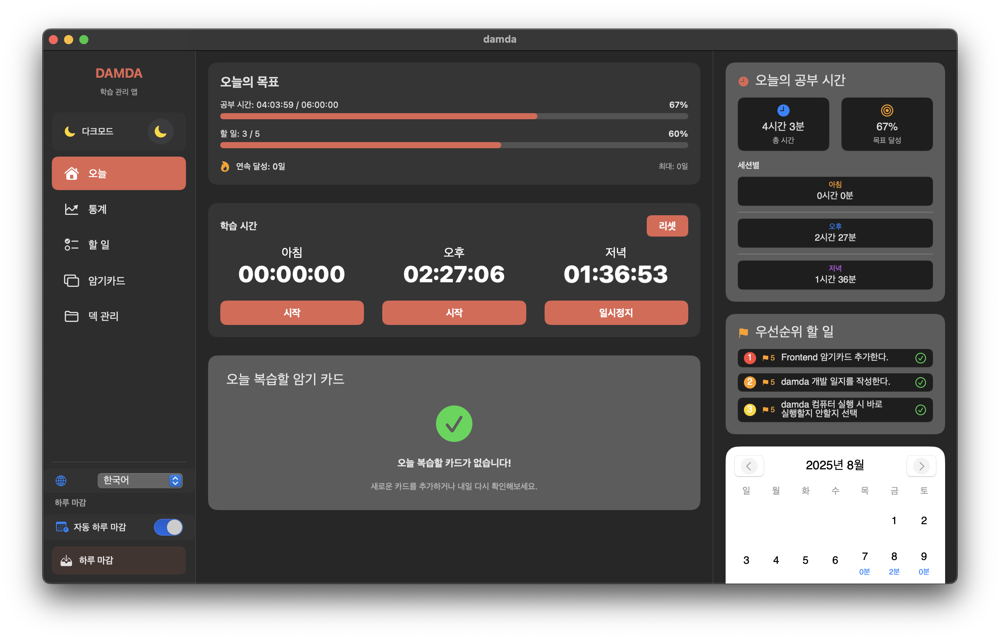

# DAMDA

할 일, 타이머, 목표 달성 여부, 암기카드(Anki 스타일)까지 한 번에 관리하는 macOS 생산성 앱입니다. vibe coding을 통해 AI 어시스턴트와의 대화로 개발되었습니다.



---

## 목차
- [주요 기능](#주요-기능)
- [설치 방법](#설치-방법)
- [빠른 시작](#빠른-시작)
- [데이터 관리](#데이터-관리)
- [완성도 및 로드맵](#완성도-및-로드맵)
- [기술 스택](#기술-스택)
- [프로젝트 구조](#프로젝트-구조)
- [라이선스](#라이선스)

---

## 설치 방법

### 방법 A. 릴리스 dmg 설치
1. 최신 dmg 다운로드(릴리스 페이지 링크 예정)
2. dmg 파일을 열고 앱을 Applications 폴더로 드래그
3. Launchpad 또는 Spotlight에서 앱 실행  
   - 첫 실행 시 시스템 설정 > 개인정보 보호 및 보안에서 허용 필요할 수 있음

### 방법 B. 소스 빌드
```bash
git clone https://github.com/ShinBeomsoo/damda.git
cd damda
open damda.xcodeproj
# Xcode에서 스킴 'damda' 실행(⌘R)
```

### 방법 C. 커맨드라인 빌드
```bash
xcodebuild -project damda.xcodeproj -scheme damda -configuration Release build
```

---

## 빠른 시작
1. 할 일 추가 및 우선순위 설정
2. 타이머에서 세션(아침/오후/저녁) 시작
3. 목표 진행률 확인
4. Deck 생성 → 카드 추가 → 오늘 복습 시작

---

## 데이터 관리
- 저장소: Core Data (엔티티: Todo, TimerRecord, StreakRecord, Card, Deck)
- SRS 알고리즘: SM-2 기반 간격 반복 복습
- 상태 저장: UserDefaults로 일부 앱 설정·타이머/카드 상태 보존
- 모델 경로: `damda/Model/damda.xcdatamodeld` (경량 마이그레이션 사용)

---

## 완성도 및 로드맵
- 현재
  - Todo/타이머/목표 추적/통계/암기카드/덱 관리 기본 기능 안정화
  - 자연어 복습 표기(오늘/내일/N일 뒤) 및 다크모드 대응
- 다음 단계(예시)
  - 덱 일괄 작업(여러 카드 이동), 정렬/검색 고도화
  - 덱 삭제 고급 옵션(다른 덱으로 이동/해제/취소 선택)
  - 카드/덱 통계 심화, 하루 복습 한도 등 옵션
  - 마이크로 인터랙션·전환/호버/스켈레톤 강화

---

## 기술 스택
- Swift 5, SwiftUI
- Core Data
- XCTest(Unit Tests)
- Charts(SwiftUI Charts)
